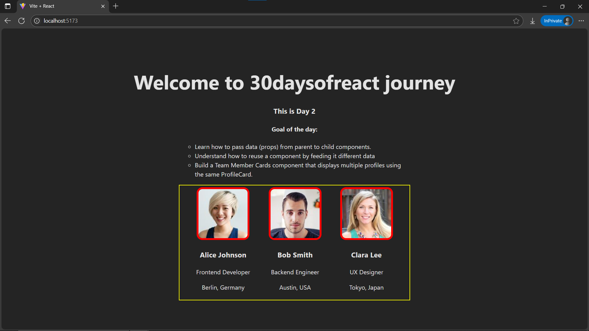

# Day2: Project - Team Member Cards using React

## 🚀 What I Built
A reusable **Profile Card component** using React **props**. The app displays a list of team members by **mapping over mock data** and rendering the same component with different data.

This project builds on simple static card and introduces **component reusability and dynamic rendering** using `props`.

---

## 🧠 What I Learned
- How to **pass props** to components.
- How to **reuse a component** with different data.
- How to **map over an array** in JSX.
- How to structure mock data in a separate file.

---

## 🛠️ Tech Stack
- React + Vite
- JSX
- Inline Styling
- ES6 Array methods (`map`)

---

## 📸 Screenshot



---

## 🧪 How to Run Locally

```bash
git clone https://github.com/ravi18kumar2021/30DaysOfReact.git
cd 30DaysOfReact/Day02
npm install
npm run dev