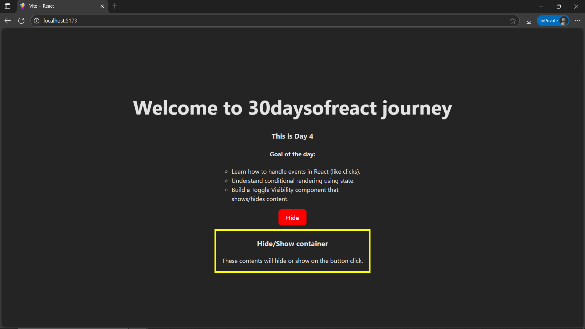
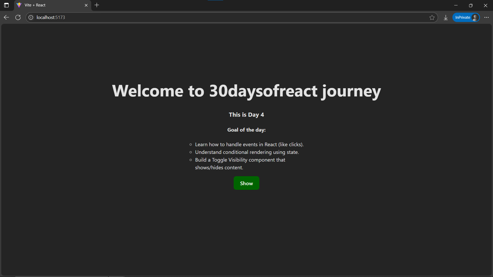

# Day4: Project - Toggle Container App using React

## 🚀 What I Built
A simple **Toggle Details** component that shows or hides a paragraph of text when a button is clicked. This project demonstrates **event handling** and **conditional rendering** in React using the `useState` hook.

---

## 🧠 What I Learned
- How to use **event handlers** like `onClick` in React.
- How to manage UI visibility with **boolean state**.
- How to **conditionally render** JSX using short-circuit logic (`&&`).
- How to toggle UI content using `useState`.

---

## 🛠️ Tech Stack
- React + Vite
- JSX
- useState Hook
- Inline Styling

---

## 📸 Screenshot




---

## 🧪 How to Run Locally

```bash
git clone https://github.com/ravi18kumar2021/30DaysOfReact.git
cd 30DaysOfReact/Day04
npm install
npm run dev