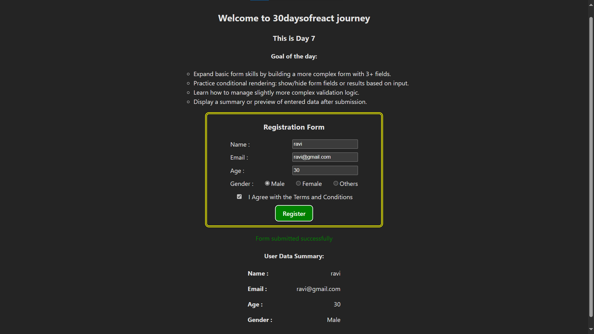

# Day7: Project - Registration Form with Validation (React)

## 🚀 What I Built

A user registration form built using **React**, featuring real-time validation, conditional rendering, and form state management using the `useState` hook.  
The form includes fields for Name, Email, Age, Gender, and Terms Agreement, and provides instant feedback with success/error messages.

---

## 🧠 What I Learned

- Handling **controlled components** using `useState`
- Writing **custom validation logic** for email, name, age, and radio/checkbox inputs
- Using **conditional rendering** to show feedback and data preview
- Dynamically **enabling/disabling the Submit button** based on form validity
- Structuring clean and user-friendly form UX in React

---

## 🛠️ Tech Stack

- React
- JSX
- useState Hook
- Basic CSS (Inline styling)

---

## 📸 Screenshot



---

## 📋 Features

- ✅ Validates:
  - Name (min. 2 characters)
  - Email (regex)
  - Age (1–120)
  - Gender selection (radio buttons)
  - Terms agreement (checkbox)
- ✅ Shows error and success messages
- ✅ Disables submit until form is valid
- ✅ Displays submitted user data after successful submission
- ✅ Hides summary if form is edited again

---

## 🧪 How to Run Locally

```bash
git clone https://github.com/ravi18kumar2021/30DaysOfReact.git
cd 30DaysOfReact/Day07
npm install
npm run dev