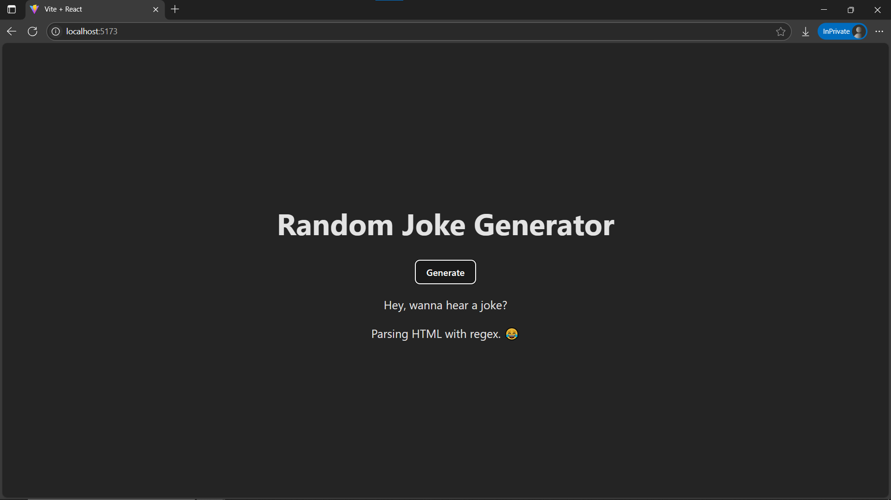

# Day 9: 😂 Joke Generator – Fetching APIs in React

## 🚀 What I Built

A simple **Joke Generator** app that fetches a random joke from an external API using `useEffect`. This project demonstrates how to perform asynchronous data fetching in React and handle loading and error states gracefully.

- Fetches a new joke on initial load
- Provides a button to fetch another joke
- Displays loading and error messages for better user experience

---

## 🧠 What I Learned

- How to perform API calls in React using `fetch`
- Using `async/await` syntax inside a function
- Managing multiple pieces of state (`loading`, `error`, `data`) with `useState`
- Handling component lifecycle with `useEffect` for fetching data
- Providing responsive and conditional UI feedback based on data fetching state

---

## 🛠️ Tech Stack

- React
- JSX
- useState Hook
- useEffect Hook
- Fetch API
- Async/Await
- Conditional Rendering
- Inline Styling

---

## 📸 Screenshot



---

## 🧪 How to Run Locally

```bash
git clone https://github.com/ravi18kumar2021/30DaysOfReact.git
cd 30DaysOfReact/Day09
npm install
npm run dev