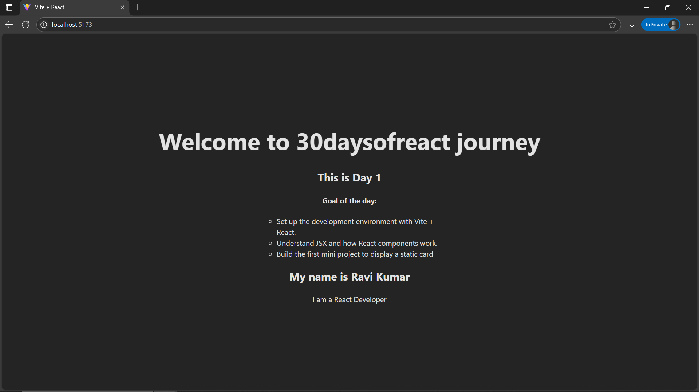

# Day1: Project - Static Profile Card App using React

## 🚀 What I Built
A simple React component that displays a static user profile card using basic JSX and inline styles.

## 🛠️ Tech Stack
- React + Vite
- JSX
- Inline Styling

## 📸 Screenshot


## 📂 Setup
```bash
git clone https://github.com/ravi18kumar2021/30DaysOfReact.git
cd 30DaysOfReact/Day1
npm install
npm run dev