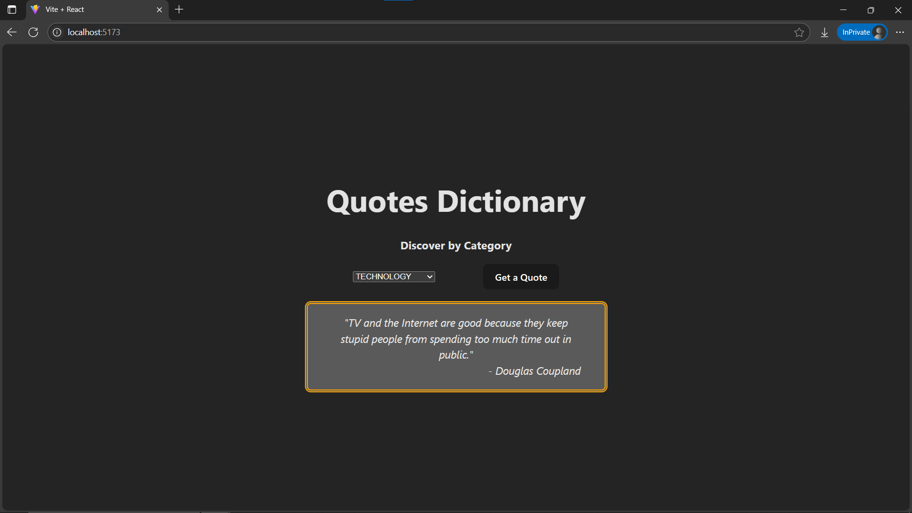

# Day10: Project - Quote Fetcher with Loader in React

## 🚀 What I Built

A **Quote Fetcher** app that retrieves random quotes from the [Quotable API](https://api.quotable.io/random) using React’s `useEffect`. It features category-based filtering, a CSS-based loader animation, and responsive conditional rendering.

- Fetch random quotes based on selected **categories**.
- Loading spinner while fetching.
- Error handling and feedback if something goes wrong.
- Clean, accessible UI with dynamic category selector.

---

## 🧠 What I Learned

- **`useEffect`** for running side effects like API calls
- How to work with **async/await** in React
- Building **controlled form elements** (select dropdown)
- **Conditional rendering** to show loading, error, or data
- Writing and styling **custom loaders** with CSS animations
- Enhanced understanding of **component lifecycle**

---

## 🛠️ Tech Stack

- React
- JSX
- useState Hook
- useEffect Hook
- Fetch API
- Inline Styling
- CSS Keyframe Animations for Loader
- Conditional Rendering

---

## 📸 Screenshot



---

## 🧪 How to Run Locally

```bash
git clone https://github.com/ravi18kumar2021/30DaysOfReact.git
cd 30DaysOfReact/Day10
npm install
npm run dev