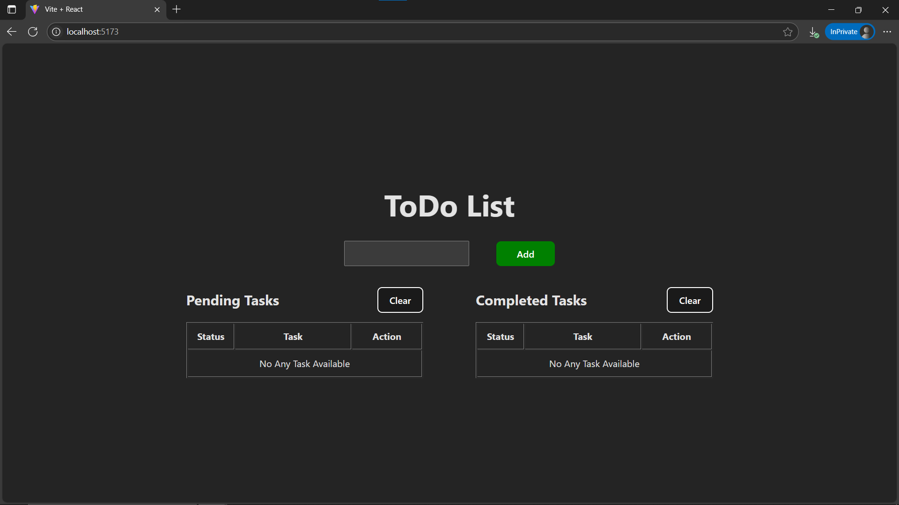
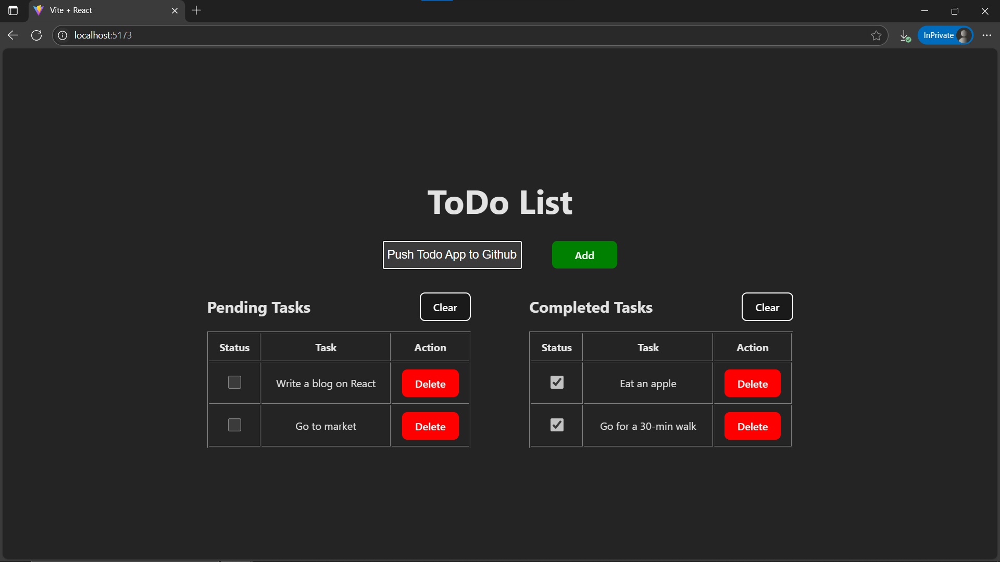

# Day11: Project - Simple To-Do List with React Lists & Keys

## 🚀 What I Built

A **Simple To-Do List** built using React to practice rendering lists with `.map()` and handling dynamic data. This project demonstrates how to manage an array of items in state, render them in the UI, and update or remove them as needed.

- Add, complete, and delete tasks
- Organize tasks into **Pending** and **Completed** sections
- Clear all pending or completed tasks at once
- Shows dynamic content and handles empty states

---

## 🧠 What I Learned

- How to use **`.map()`** to render lists in React
- Why **keys** are important for list rendering
- Managing arrays with **`useState`**
- Building **controlled components** for user input
- Conditionally rendering UI based on array length
- Handling multiple pieces of related state (e.g., task lists, input field)

---

## 🛠️ Tech Stack

- React
- JSX
- useState Hook
- Conditional Rendering
- CSS (linked external `TodoList.css` file for minor styling)

---

## 📸 Screenshots




---

## 🧪 How to Run Locally

```bash
git clone https://github.com/ravi18kumar2021/30DaysOfReact.git
cd 30DaysOfReact/Day11
npm install
npm run dev