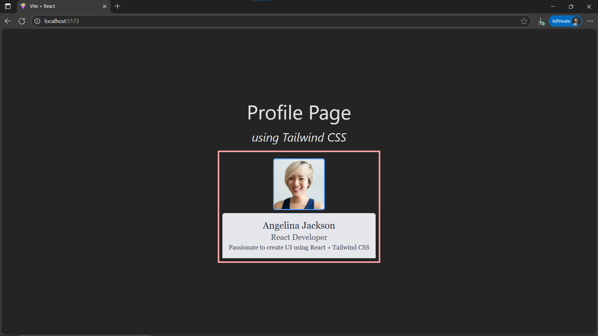

# Day12: Project - Profile Card Component with Tailwind CSS

## 🚀 What I Built

A **Profile Card** React component designed to be **reusable** and **customizable** by passing props like `name`, `image`, `designation`, and `description`. The component is fully styled using **Tailwind CSS** utility classes.

- Dynamic content through React props
- Clean layout with Tailwind utility-first classes
- Semantic, accessible HTML structure
- Focus on modular, reusable component design

---

## 🧠 What I Learned

- How to **style React components** using **Tailwind CSS** only
- Passing **props** into a component for reusability
- Using Tailwind’s **spacing**, **color**, **typography**, and **border** utilities
- Keeping React components **small**, **focused**, and **declarative**
- Combining layout and visual styles cleanly with **utility-first CSS**

---

## 🛠️ Tech Stack

- React
- JSX
- Tailwind CSS
- CSS Modules (Optional, Used before Tailwind CSS)

---

## 📸 Screenshot



---

## 🧪 How to Run Locally

```bash
git clone https://github.com/ravi18kumar2021/30DaysOfReact.git
cd 30DaysOfReact/Day12
npm install
npm run dev