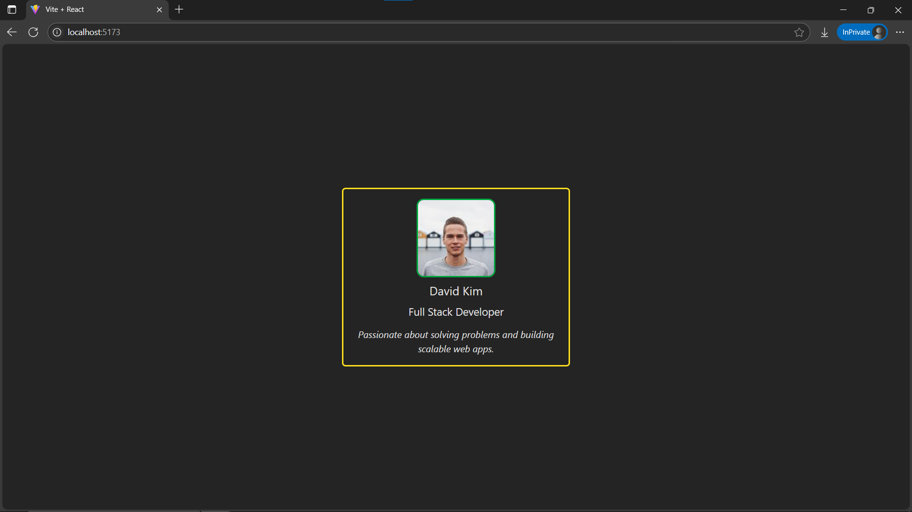

# Day13: Project - Profile with Nested Components (Props Drilling)

## 🚀 What I Built

A **Profile Page** built with **multiple nested components** to demonstrate **props drilling** in React. This project focuses on **passing data** from a parent component down through multiple layers of child components to render a complete profile view.

- Nested components structure
- Props passed down multiple levels (drilling)
- Clean, modular, and reusable component design
- Styled using Tailwind CSS

---

## 🧠 What I Learned

- What **props drilling** is in React
- How to break down a UI into **small, focused components**
- How to **pass data (props)** through multiple component layers
- Why **deeply nested props** can become repetitive → leading to `useContext` (future learning)
- Continued using **Tailwind CSS** for modern, responsive styling

---

## 🛠️ Tech Stack

- React
- JSX
- Tailwind CSS

---

## 📸 Screenshot



---

## 🧪 How to Run Locally

```bash
git clone https://github.com/ravi18kumar2021/30DaysOfReact.git
cd 30DaysOfReact/Day13
npm install
npm run dev