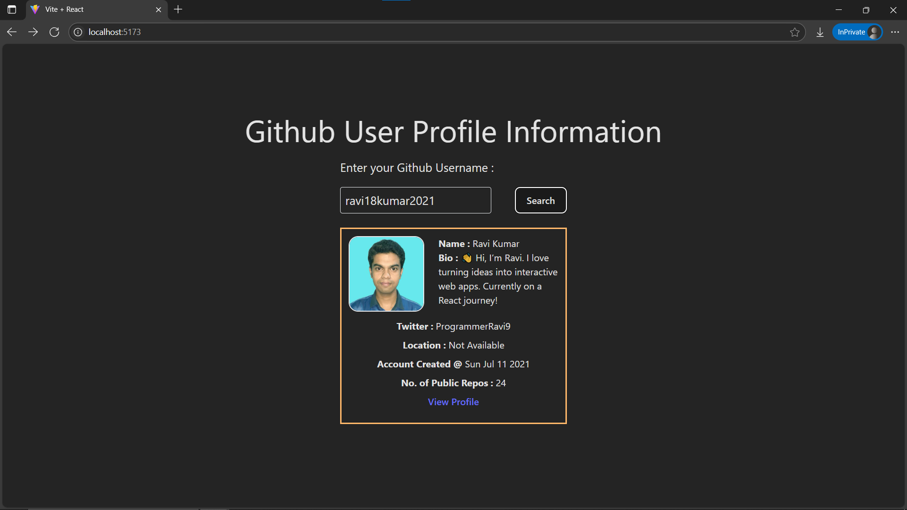

# Day14: Project - GitHub User Finder

## 🚀 What I Built

A **GitHub User Finder** app that allows users to search for any GitHub profile by username and displays useful information fetched directly from the **GitHub API**. This project combines everything learned so far, including **forms**, **API fetching**, **conditional rendering**, and **component composition**.

- **Dynamic search** using a controlled form input
- **Fetches user profile data** from GitHub
- Displays key information like avatar, bio, repos, name and more
- **Error handling** for invalid usernames
- **Loading spinner** for better UX
- Responsive, modern UI built with **Tailwind CSS**

---

## 🧠 What I Learned

- How to fetch **external API data** in React
- Managing **loading**, **error**, and **success** states in UI
- Building **controlled form inputs**
- Using **conditional rendering** to control what’s displayed
- Organizing components for **clean and maintainable code**
- Working with **real-world APIs** and understanding their structure

---

## 🛠️ Tech Stack

- React
- JSX
- Tailwind CSS
- Fetch API (async/await)

---

## 📸 Screenshot



---

## 🔗 API Used

- [GitHub REST API – Users](https://api.github.com/users/{username})

Example:
https://api.github.com/users/ravi18kumar2021

---

## ✅ Data Fetched & Displayed

| **Field**           | **Description**                      |
|---------------------|--------------------------------------|
| `avatar_url`        | User’s profile picture               |
| `name`              | Full name or GitHub username         |
| `bio`               | Short description provided by user  |
| `location`          | User’s location                     |
| `public_repos`      | Number of public repositories       |
| `twitter_username`  | Linked Twitter handle (if available) |
| `created_at`        | Date the user joined GitHub          |
| `html_url`          | Link to user’s GitHub profile       |

---

## 🧪 How to Run Locally

```bash
git clone https://github.com/ravi18kumar2021/30DaysOfReact.git
cd 30DaysOfReact/Day14
npm install
npm run dev