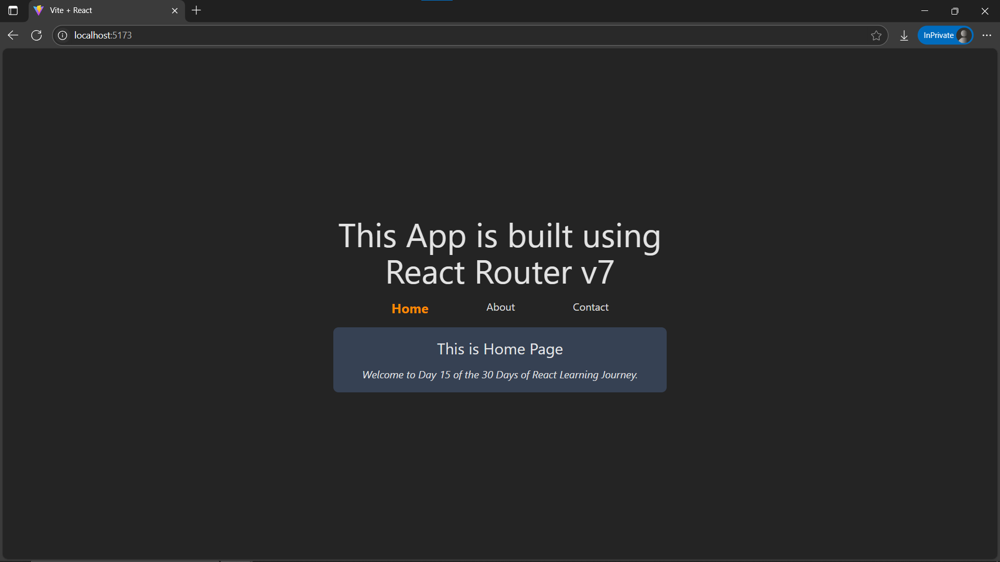

# Day15: Project - Multi-page App

## 🚀 What I Built

A **multi-page React application** using **React Router (createBrowserRouter, RouterProvider)** to demonstrate **basic routing** concepts. This project focuses on creating **multiple routes/pages** in a **Single Page Application (SPA)** using nested routing.

### ✨ Features
- **Multiple pages:** Home, About, Contact
- **React Router v7 (createBrowserRouter)** for route configuration
- **Nested routing** with `<Outlet>` support in `App.jsx`
- **Navigation Bar (Navbar)** for switching between pages
- Active route highlighting using `NavLink`
- Styled with **Tailwind CSS**

---

## 🧠 What I Learned

- How to set up **React Router v7** with `createBrowserRouter` and `RouterProvider`
- Defining **nested routes** with child components
- Using `<NavLink>` for **active link styling**
- Difference between **traditional navigation** and **SPA routing**
- Styling navigation and components with **Tailwind CSS**

---

## 🛠️ Tech Stack

- React
- JSX
- Tailwind CSS
- React Router v7

---

## 📸 Screenshot



---

## 🧪 How to Run Locally

```bash
git clone https://github.com/ravi18kumar2021/30DaysOfReact.git
cd 30DaysOfReact/Day13
npm install
npm run dev
