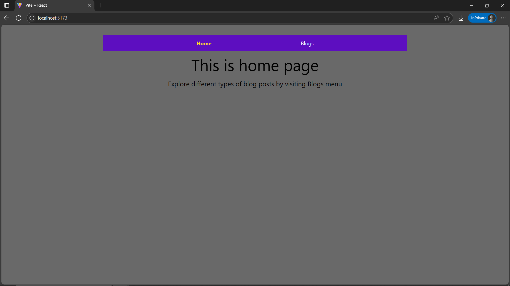
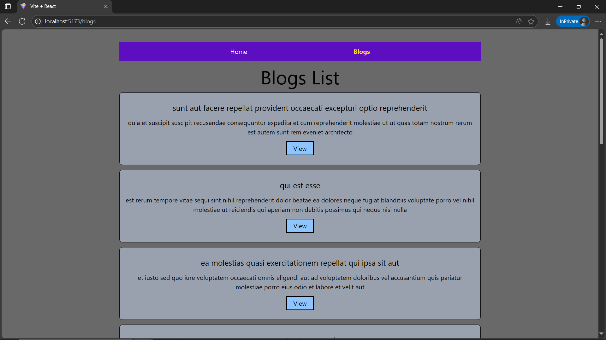
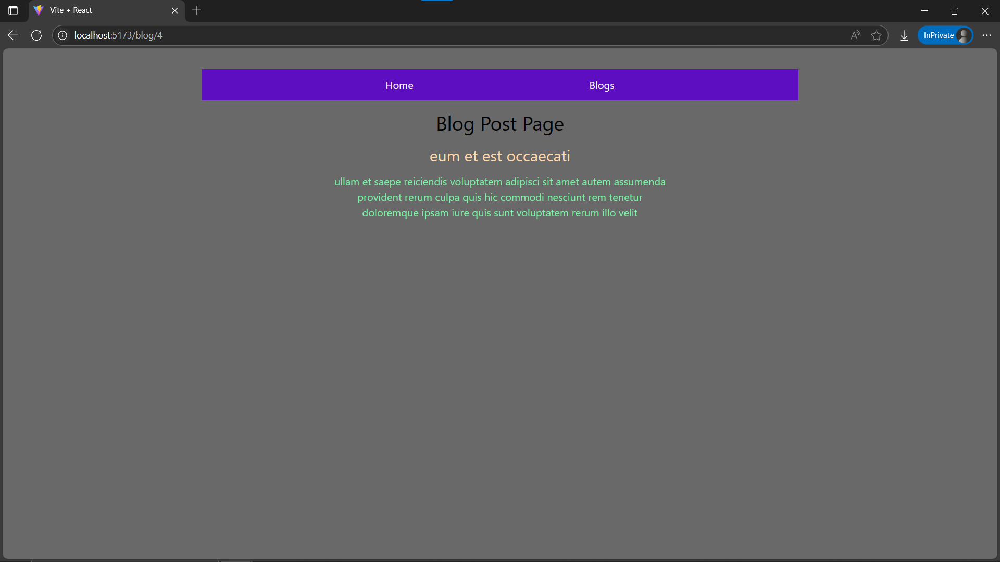

# Day16: Project - Blog Viewer (Nested Routes & Params)

## 🚀 What I Built

A **Blog Viewer Application** demonstrating **nested routes** and how to extract **dynamic parameters from the URL** to display individual blog posts. This project integrates fetching data from a public API to populate the blog list and individual post views, showcasing a more realistic application of routing.

- Dynamic routing for individual blog posts using URL parameters.
- Nested routes structure (e.g., `/blog` and `/blog/:postId`).
- Data fetching from `jsonplaceholder.typicode.com/posts` API.
- Loading and error states handling during API calls.
- Clear and intuitive navigation using `NavLink`.
- Styled using Tailwind CSS.

---

## 🧠 What I Learned

- How to define **nested routes** using `createBrowserRouter` in React Router v7.
- How to extract **dynamic URL parameters** (e.g., `postId`) using the `useParams` hook.
- How to structure a React application with a shared layout using `Outlet`.
- Best practices for navigation using `NavLink` to automatically highlight active links.
- Integrating **API calls** (`useEffect`, `useState`, `fetch`) within routed components.
- Implementing **loading and error states** for a better user experience during data fetching.
- Continued using **Tailwind CSS** for modern and responsive UI design.

---

## 🛠️ Tech Stack

- React
- React Router v7
- JSX
- Tailwind CSS
- JSONPlaceholder API

---

## 📸 Screenshot







---

## 🧪 How to Run Locally

```bash
git clone https://github.com/your-username/30DaysOfReact.git
cd 30DaysOfReact/Day16
npm install
npm run dev