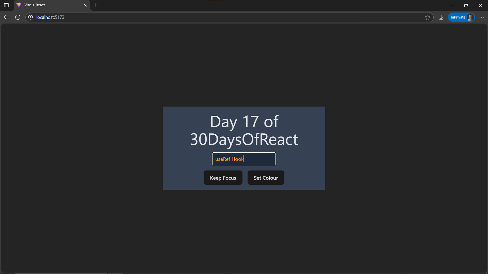

# Day17: Project - Focus Input on Load (useRef)

## 🚀 What I Built

A **Focus Input on Load** app built using **useRef** and **useEffect** to programmatically control focus and styling on an input element.

- Automatically **focusing** an input field when the page loads
- Using a button to **keep focus** on the input manually
- Another button to **change the input text color randomly** on click
- Demonstrates direct DOM manipulation with `useRef`
- Styled using Tailwind CSS

---

## 🧠 What I Learned

- How to use **`useRef()`** to reference and interact with **DOM elements** in React
- Using **`useEffect()`** to **focus the input when the component loads**
- Setting focus on input fields **programmatically**
- Modifying DOM properties like `style.color` directly via ref
- Continued practicing **Tailwind CSS** for modern, responsive styling

---

## 🛠️ Tech Stack

- React
- JSX
- Tailwind CSS
- Vite

---

## 📸 Screenshot



---

## 🧪 How to Run Locally

```bash
git clone https://github.com/ravi18kumar2021/30DaysOfReact.git
cd 30DaysOfReact/Day17
npm install
npm run dev