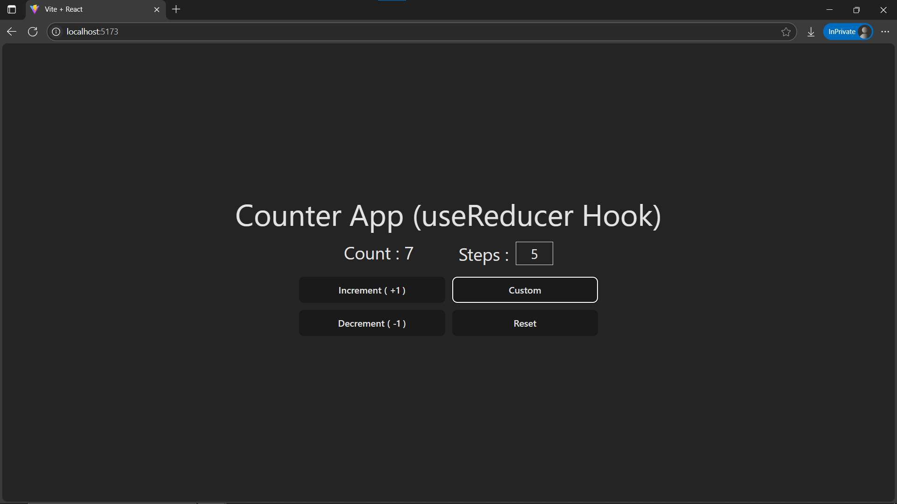

# Day18: Project - Complex Counter (useReducer)

## 🚀 What I Built

A **Complex Counter** project built with React using the **`useReducer()`** hook to handle multiple actions. This project introduces flexible state management for **incrementing**, **decrementing**, **resetting**, and changing the count by a **custom positive or negative value**.

### ✨ Features
- ➕ **Increment by 1**
- ➖ **Decrement by 1**
- 🔁 **Reset to Zero** → also resets the custom input field to 1
- ⚙️ **Custom Change by Positive or Negative Value**
  - Users can input **positive** or **negative** numbers to adjust the count
  - Example: Enter `5` → increment by 5 | Enter `-2` → decrement by 2
- Styled with **Tailwind CSS**

---

## 🧠 What I Learned

- Using **`useReducer()`** for handling **complex state logic** in React components.
- Structuring **multiple actions** inside a reducer with **action types** and **payloads**.
- Managing **controlled input components** in React.
- Validating user input to accept only numeric values.
- Combining **`useState()`** with `useReducer()` for advanced interactivity.

---

## 🛠️ Tech Stack

- React
- JSX
- Tailwind CSS
- Vite (for project setup)

---

## 📸 Screenshot



---

## 🧪 How to Run Locally

```bash
git clone https://github.com/ravi18kumar2021/30DaysOfReact.git
cd 30DaysOfReact/Day18
npm install
npm run dev