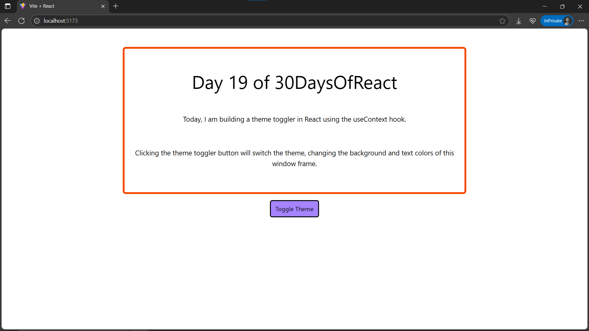
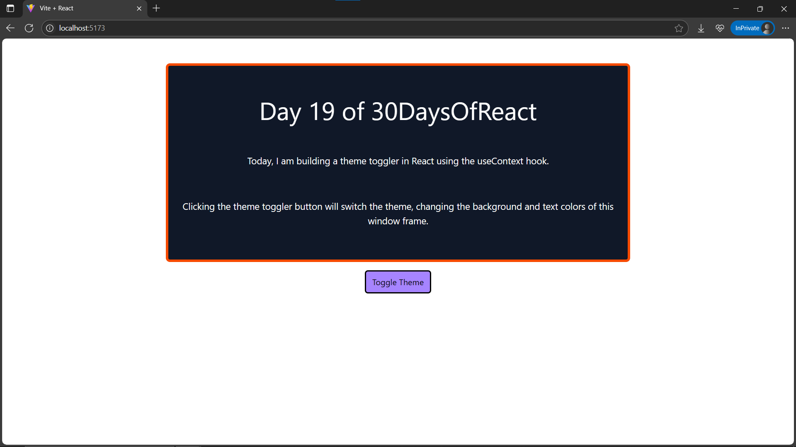

# Day19: Project - Theme Switcher (useContext)

## 🚀 What I Built

A **Theme Switcher** project using **`useContext()`** in React to manage and share global theme state across components. This project demonstrates how to **avoid props drilling** by using React Context to control the theme across the app.

### ✨ Features
- 🌗 **Toggle between Light & Dark Themes**
- 📦 **Global State** using `ThemeContext` → no need to pass props through multiple component layers
- 🎨 The entire **WindowFrame** changes its background and text colors based on the active theme
- ⚡ Smooth styling with **Tailwind CSS**

---

## 🧠 What I Learned

- How to use **`createContext()`** and **`useContext()`** to share state globally across components
- How to **toggle** between themes using **`useState()`** inside a context provider
- How **Context API** helps eliminate **props drilling**
- Reinforced how to apply **conditional styling** with **Tailwind CSS** in React components

---

## 🛠️ Tech Stack

- React
- JSX
- useContext API
- Tailwind CSS
- Vite (for project setup)

---

## 📸 Screenshots





---

## 🧪 How to Run Locally

```bash
git clone https://github.com/ravi18kumar2021/30DaysOfReact.git
cd 30DaysOfReact/Day19
npm install
npm run dev