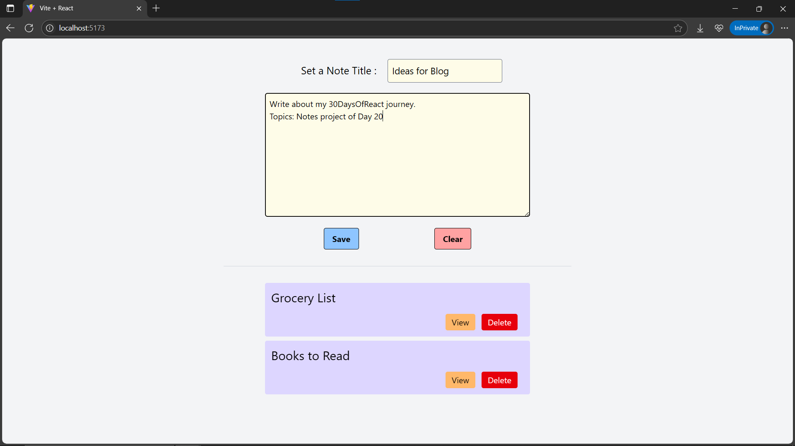

# Day20: Project - Notes App

## 🚀 What I Built

A **Notes App** with **title** and **content** fields. This app allows users to **add**, **view**, **delete**, and **clear** notes. It also provides a **view mode** to temporarily display individual notes with their full content.

### ✨ Features
- ➕ **Add Notes** with Title and Content
- 🗑️ **Delete Notes** individually
- 👀 **View Mode** → read individual notes in full, disabling editing
- ❌ **Cancel View** to return to adding new notes
- 🧹 **Clear Form** when writing a new note
- 🎨 Fully styled with **Tailwind CSS**

---

## 🧠 What I Learned

- Handling **multiple pieces of related state** with `useState()`
- Managing **controlled form inputs** (input + textarea)
- Working with **arrays in React state** for adding/deleting
- Creating **dynamic UI** with **conditional rendering**
- Continued applying **Tailwind CSS** for layout and design

---

## 🛠️ Tech Stack

- React
- JSX
- Tailwind CSS
- Vite (for project setup)

---

## 📸 Screenshot



---

## 🧪 How to Run Locally

```bash
git clone https://github.com/ravi18kumar2021/30DaysOfReact.git
cd 30DaysOfReact/Day20
npm install
npm run dev