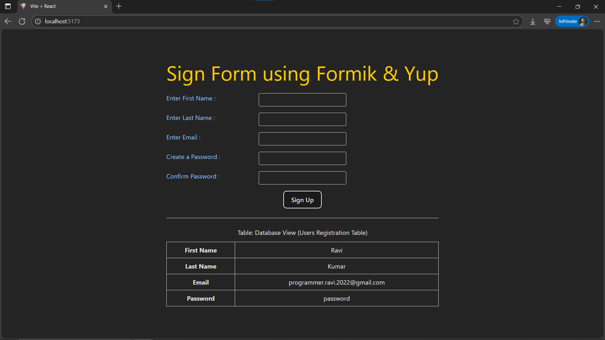

# Day21: Project - Signup Form with Formik & Yup

## 🚀 What I Built

A **Signup Form** using **Formik** for form state management and **Yup** for form validation. The form captures user details like **First Name**, **Last Name**, **Email**, and **Password (with confirmation)**. After submission, the submitted data is displayed in a table format on the page.

### ✨ Features
- 🖋 **First Name** & **Last Name** → Required, 3–10 characters, no leading/trailing spaces
- 📧 **Email** → Required, must follow valid email format
- 🔒 **Password + Confirm Password** → Required, at least 6 characters, both must match
- ⚠️ **Real-time validation errors** shown under each field
- ✅ **Form Reset** button to clear all input fields
- 📋 **Submitted Data View** → Displays entered data in a clean HTML table

---

## 🧠 What I Learned

- Using **Formik** to handle controlled form inputs
- Defining **validation schemas** with **Yup** for:
  - Required fields
  - Pattern-based input validation
  - Matching passwords
- How to **conditionally render** submitted data in React
- Using `<ErrorMessage />` component in Formik to show field-specific errors

---

## 🛠️ Tech Stack

- React
- Formik
- Yup
- Tailwind CSS
- Vite (for project setup)

---

## 📸 Screenshot



---

## 🧪 How to Run Locally

```bash
git clone https://github.com/ravi18kumar2021/30DaysOfReact.git
cd 30DaysOfReact/Day21
npm install
npm run dev