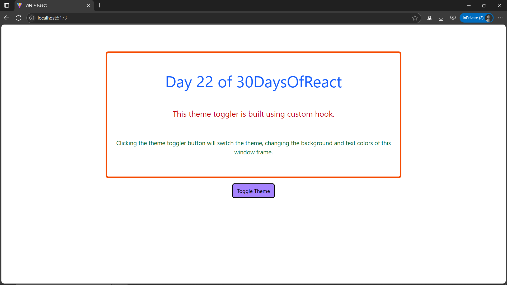

# Day22: Project - Theme Preference with Custom Hook (useLocalStorage)

## 🚀 What I Built

A **Theme Switcher** application with **persistent theme preference** using a **custom React Hook** called `useLocalStorage()`. The theme preference (Light/Dark) **persists** across page reloads using **localStorage**.

### ✨ Features
- 🌗 **Toggle between Light & Dark Themes**
- 💾 **Persistent Preference** → Stored in **localStorage**
- 🏗 **Custom Hook → `useLocalStorage()`** to reuse this pattern in other projects
- 📦 **Global State** using React **Context API** → theme is accessible anywhere in the app

---

## 🧠 What I Learned

- ✅ How to create a **custom React Hook**
- ✅ Using **localStorage** with React to persist data across reloads
- ✅ Working with **Context API** for **global state**
- ✅ Combining hooks like `useState()`, `useEffect()`, and **custom hooks** for powerful solutions

---

## 🛠️ Tech Stack

- React
- Context API
- Custom Hooks (`useLocalStorage`)
- Tailwind CSS
- Vite (for project setup)

---

## 📸 Screenshots




---

## 🧪 How to Run Locally

```bash
git clone https://github.com/ravi18kumar2021/30DaysOfReact.git
cd 30DaysOfReact/Day22
npm install
npm run dev