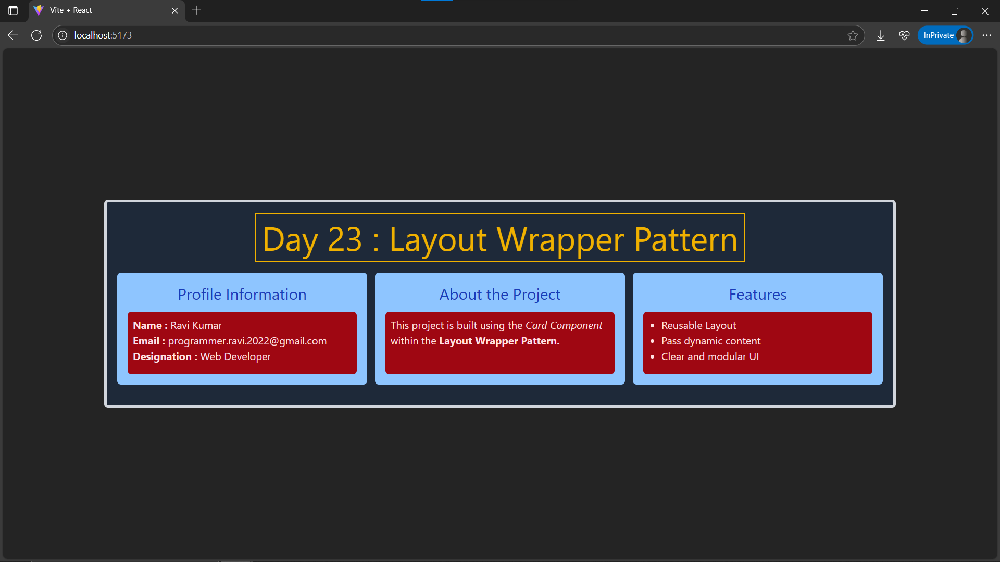

# Day23: Project - Layout Wrapper (Composition Pattern)

## 🚀 What I Built

A **Layout Wrapper** project demonstrating **composition patterns** in React. This project focuses on creating a **reusable layout component** that can wrap any content passed as `children`. It helps in avoiding code duplication and maintaining consistent layout styling across components.

### ✨ Features
- 🏗 **Reusable LayoutCard component**
- 📦 Uses **React children prop** for dynamic content insertion
- 🖼 **Title prop** for flexible headings in each card
- 🎨 Consistent styling using **Tailwind CSS**
- ✅ Demonstrates the **composition** concept by wrapping multiple different content blocks in a shared layout

---

## 🧠 What I Learned

- Understanding **composition patterns** in React
- Using **`children`** prop to make components **dynamic and reusable**
- Building **generic wrapper components** for consistent layouts
- Continued applying **Tailwind CSS** to build **modular, clean UIs**
- Realized that **composition > inheritance** in React component design

---

## 🛠️ Tech Stack

- React
- JSX
- Tailwind CSS
- Vite (for project setup)

---

## 📸 Screenshot



---

## 🧪 How to Run Locally

```bash
git clone https://github.com/ravi18kumar2021/30DaysOfReact.git
cd 30DaysOfReact/Day23
npm install
npm run dev