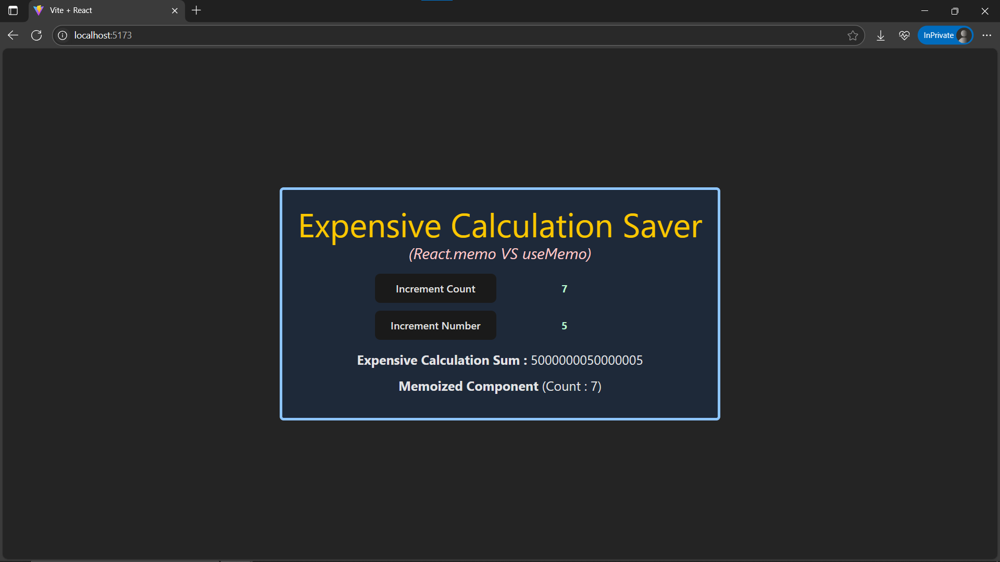

# Day24: Project - Expensive Calculation Saver with useMemo() & React.memo()

## 🚀 What I Built

A project demonstrating **memoization techniques** in React using **`useMemo()`** and **`React.memo()`** to optimize performance. The app features:
- An **expensive calculation** wrapped with **`useMemo()`** to prevent unnecessary recalculations.
- A **UI component** wrapped with **`React.memo()`** to avoid unnecessary re-renders if its props do not change.
- Two buttons → one changes the number to recalculate, the other changes a count for unrelated state.

### ✨ Features
- ✅ **useMemo()** for memoizing **expensive calculations**
- ✅ **React.memo()** for memoizing **entire components**
- ⚡ Demonstrates **performance optimization**
- 👀 Console logs show **when calculations or renders happen**
- 🎨 Clean, responsive UI styled with **Tailwind CSS**

---

## 🧠 What I Learned

- ✅ How to **use `useMemo()`** to prevent recalculations unless dependencies change
- ✅ How to **use `React.memo()`** to prevent component re-renders unless props change
- ✅ The **difference between useMemo() and React.memo()**
- ⚙ Understanding when **memoization is helpful** (and when it’s unnecessary)
- 💻 Continued practice with **component-based architecture** and **Tailwind CSS**

---

## 🛠️ Tech Stack

- React
- JSX
- useMemo Hook
- React.memo()
- Tailwind CSS
- Vite (for project setup)

---

## 📸 Screenshot



---

## 🧪 How to Run Locally

```bash
git clone https://github.com/ravi18kumar2021/30DaysOfReact.git
cd 30DaysOfReact/Day24
npm install
npm run dev