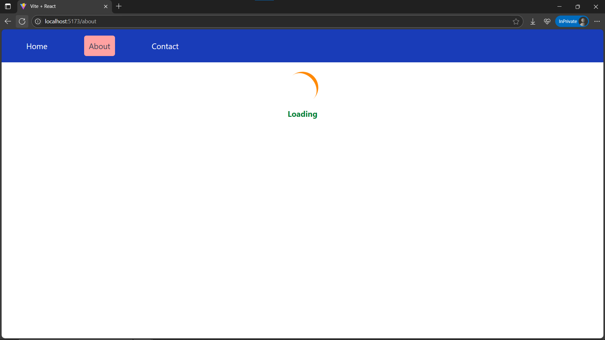
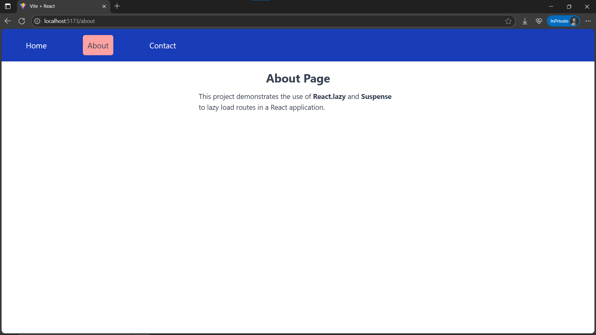

# Day25: Project - Lazy Loaded Routes with React.lazy() and Suspense

## 🚀 What I Built

A React application demonstrating **code splitting and route-based lazy loading** using:

- 🔁 `React.lazy()` to lazy-load individual pages (Home, About, Contact)
- ⏳ `Suspense` to show a **fallback loading UI** while components load
- 🧭 `React Router v7` with a **layout route** that wraps all pages in a common `Navbar`
- 🎨 Clean, reusable UI using **Tailwind CSS**

---

## ✨ Features

- 🧠 Three separate pages: **Home**, **About**, **Contact**
- 🧭 **Navigation Bar** always visible across routes
- ⏱ **Lazy loaded routes** for improved initial load time
- 📦 **Code splitting** → routes are loaded only when needed
- 💡 Uses a shared `Layout` component with `<Outlet />` and `Navbar`
- 🌀 **Loading spinner** (with Tailwind animation) shown below navbar while content loads

---

## 🧠 What I Learned

- ✅ How to implement **React.lazy()** to dynamically import components
- ✅ Using **Suspense** to wrap lazily loaded components and show fallback UI
- ✅ Creating **nested routes** and layout patterns using `createBrowserRouter()`
- ✅ Keeping UI consistent using **layout composition**
- ✅ Improved understanding of **performance optimization** via **code splitting**

---

## 🛠️ Tech Stack

- React
- React Router v7
- React.lazy() & Suspense
- Tailwind CSS
- Vite (for project setup)

---

## 📸 Screenshots





---

## 🧪 How to Run Locally

```bash
git clone https://github.com/ravi18kumar2021/30DaysOfReact.git
cd 30DaysOfReact/Day25
npm install
npm run dev