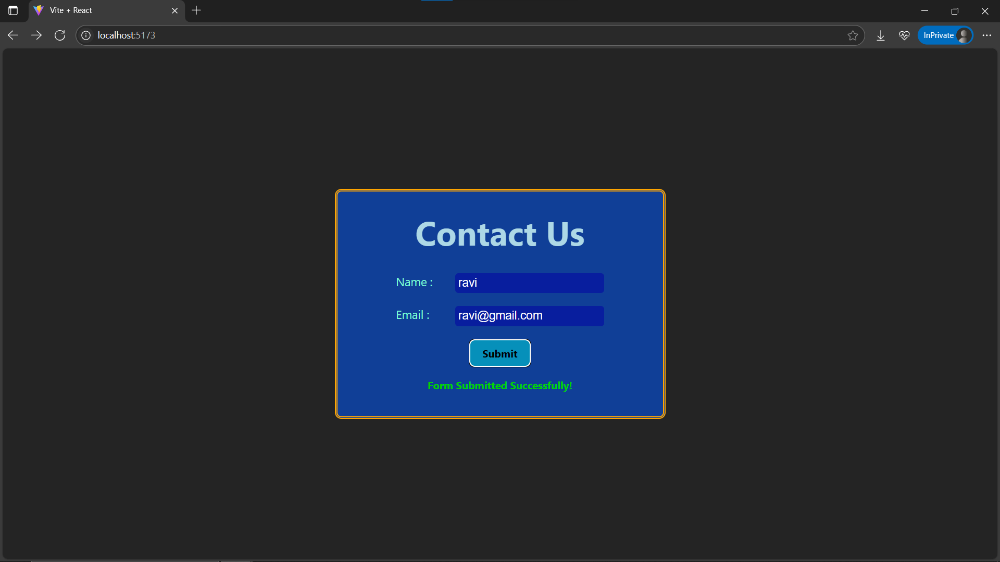
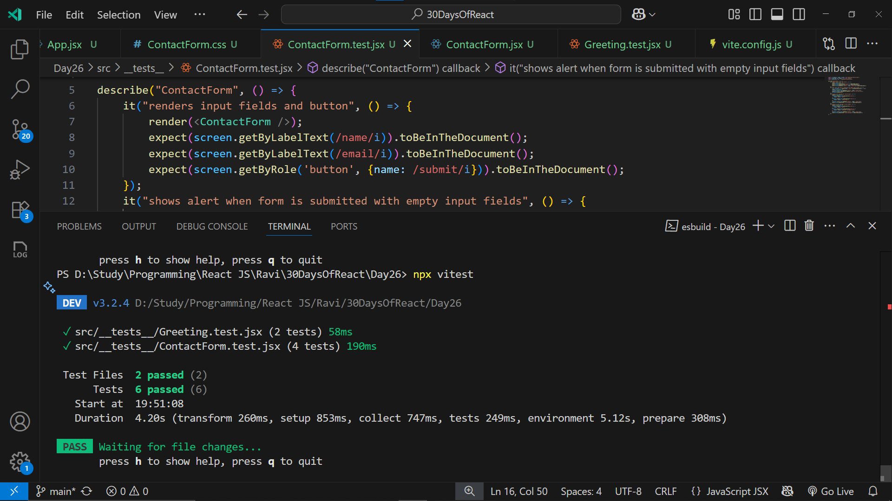

# Day26: Project - Testable Form Component (Vitest + React Testing Library)

## 🚀 What I Built

A **Contact Form** built with React that includes **form validation** and is fully **unit tested** using:
- 🧪 **Vitest** as the test runner
- 🔬 **React Testing Library (RTL)** for DOM interaction and assertions

The form includes:
- Input fields for **Name** and **Email**
- Validation for **empty fields** and **invalid email format**
- **Success and error messages**
- An `alert()` trigger for empty submissions

---

## ✨ Features

- 📥 Two controlled inputs: Name and Email
- ✅ Email is validated with a regex pattern
- ⚠ Shows:
  - Alert on empty fields
  - Inline error on invalid email
  - Success message on valid submission
- 🧪 Four unit tests:
  1. Renders all form elements
  2. Triggers alert for empty submission
  3. Displays error for invalid email
  4. Displays success message on valid input

---

## 🧠 What I Learned

- How to use **React Testing Library** for DOM-based testing
- How to use **Vitest** with Vite projects
- Spying on `window.alert()` using `vi.spyOn()`
- Writing clear, isolated, and testable form components
- Best practices for testing form validations and user feedback

---

## 🛠️ Tech Stack

- React
- Vite
- Vitest (test runner)
- React Testing Library
- Plain CSS (no Tailwind used)

---

## 📸 Screenshots





---

## 🧪 How to Run Locally

```bash
git clone https://github.com/ravi18kumar2021/30DaysOfReact.git
cd 30DaysOfReact/Day26
npm install
npm run dev