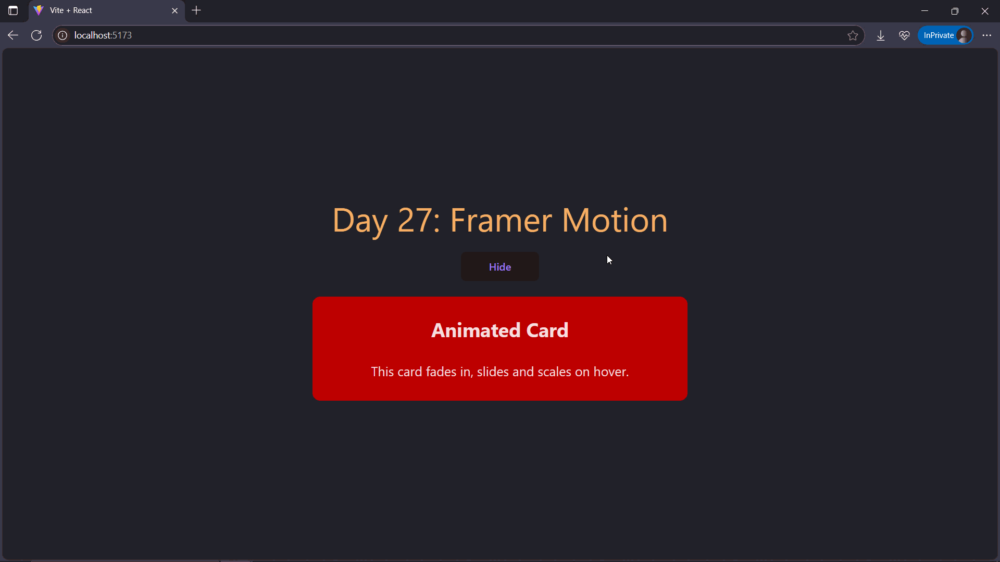

# Day27: Project – Animated Card with Framer Motion

## 🚀 What I Built

An **Animated Card** using [Framer Motion](https://motion.dev/) to demonstrate **animation basics** in React.

### 🎯 Features
- Card **fades in and slides down** when it appears
- Card **slides up and fades out** when hidden
- Toggle card visibility with a button
- Uses `AnimatePresence` for **exit animations**
- Clean UI and minimal styling

---

## 📸 Demo



> ✨ A smooth entry and exit animation triggered by toggling visibility.

---

## 🧠 What I Learned

- How to use `<motion.div>` as an animated container
- Animate component on mount using `initial` and `animate` props
- Animate exit using the `exit` prop
- Control visibility with state and `AnimatePresence`
- How to cleanly separate animation logic from component structure

---

## 🛠️ Tech Stack

- React
- Framer Motion
- Tailwind CSS
- Vite (project setup)

---

## 🧪 How to Run Locally

```bash
git clone https://github.com/ravi18kumar2021/30DaysOfReact.git
cd 30DaysOfReact/Day27
npm install
npm run dev