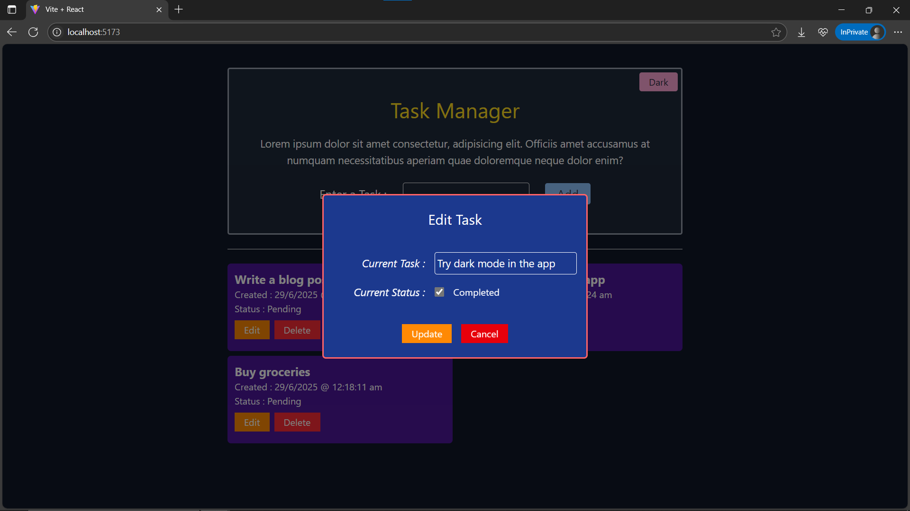

# Day28: Project – Task Manager (CRUD App)

## 🚀 What I Built

A **fully functional Task Manager** in React with:

- 📋 Create, Read, Update, Delete (CRUD) operations
- 🌓 Light/Dark theme toggle using **Context API**
- 🧩 Modal-based UI for editing, errors and confirmations
- 💾 Task persistence via component state

---

## ✨ Features

- ✅ Add new tasks
- 🗂 View task list with creation timestamp
- 🟩 Toggle task status (Pending ↔ Completed)
- ✏️ Edit task title and status via a modal
- 🗑 Delete task with confirmation
- ⚠ Error modal for empty task input
- 🎨 Light/Dark Theme toggle using Context
- 🧩 Clean UI with **conditional modals** for edit/delete/alert

---

## 🧠 What I Learned

- How to manage complex UI state (modals, editing, errors)
- Best practices for controlled components
- How to isolate modal logic and keep UI clean
- How to use **Context API** to manage global theme
- Improved JSX structure, event handling and styling logic

---

## 🛠️ Tech Stack

- React
- useState, useEffect
- Context API
- Conditional rendering
- Tailwind CSS (utility-first styling)

---

## 📸 Screenshot



> Modals appear over content, dim the background, and disable scroll using `overflow-hidden` on `<body>`.

---

## 🧪 How to Run Locally

```bash
git clone https://github.com/ravi18kumar2021/30DaysOfReact.git
cd 30DaysOfReact/Day28
npm install
npm run dev