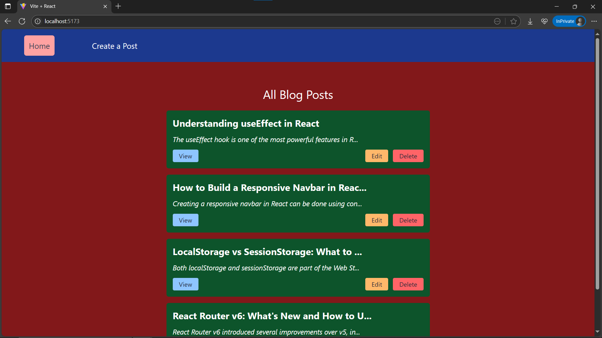
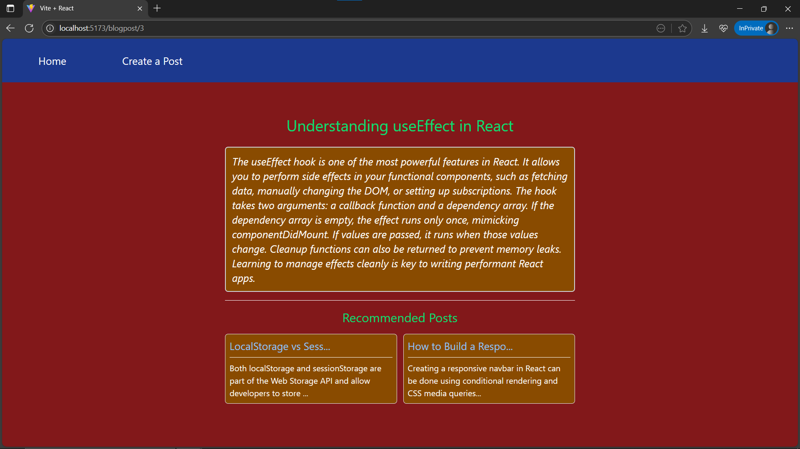
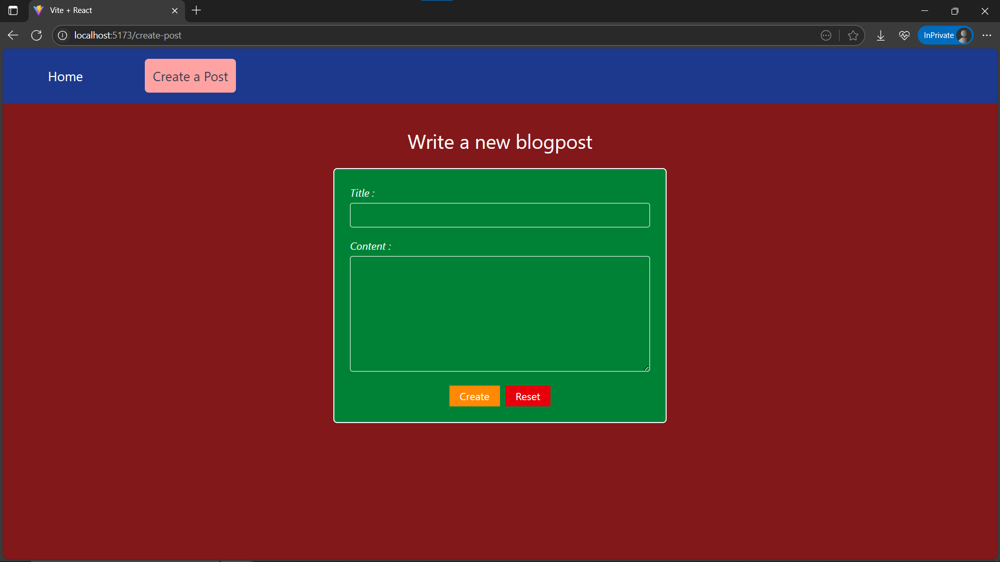

# Day29: Project – Blog App (CRUD)

## 🚀 What I Built

A fully functional **React Blog App** with:

- 📝 Create, edit, and delete posts
- 🧭 Dynamic routing with `react-router`
- 🔍 View post details
- ✏️ Edit post content inline
- 🧠 Recommended posts logic
- 💬 Truncated post previews (title + content)
- 💾 State managed with `useState`

---

## ✨ Features

- ✅ Create a new blog post
- 📃 View all posts
- 🔁 Edit existing posts
- ❌ Delete posts
- 💬 Truncated preview in blog list
- 📖 Post detail view with 2 recommended articles
- 🧭 Navigation via React Router
- 📂 Clean, modular component structure

---

## 🧠 What I Learned

- How to use `useParams`, `useNavigate`, `Outlet`, and `useOutletContext` with `react-router`
- How to build dynamic pages like `/blogpost/:postId`
- How to share state across pages via `Outlet context`
- How to truncate long strings elegantly with a utility function
- Component structure and reuse via `PostForm`

---

## 🛠️ Tech Stack

- React
- React Router v7
- JavaScript
- Tailwind CSS
- Vite (Project Setup)

---

## 📸 Screenshots







## 📦 How to Run Locally

```bash
git clone https://github.com/ravi18kumar2021/30DaysOfReact.git
cd 30DaysOfReact/Day29
npm install
npm run dev