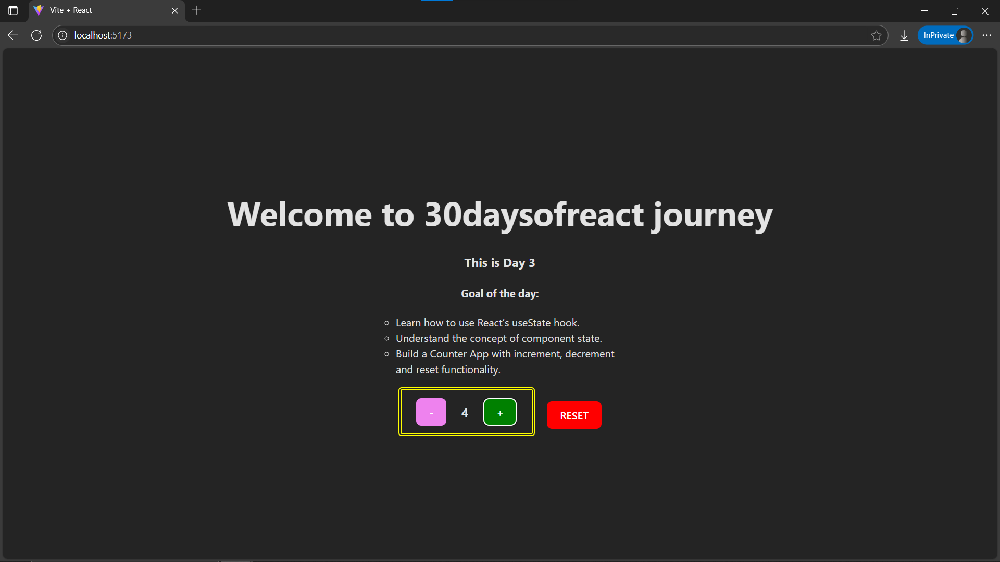

# Day3: Project - Counter App using React

## 🚀 What I Built
A simple but powerful **Counter App** using React’s `useState` hook. This project introduces **stateful logic** and **UI updates** based on state changes. The app includes buttons to **increment**, **decrement**, and **reset** the counter.

---

## 🧠 What I Learned
- How to use the **`useState`** hook.
- How to manage and update **local component state**.
- How to trigger state updates via **event handlers**.
- How React automatically re-renders the component when state changes.

---

## 🛠️ Tech Stack
- React + Vite
- JSX
- `useState` Hook
- Inline Styling

---

## 📸 Screenshot



---

## 🧪 How to Run Locally

```bash
git clone https://github.com/ravi18kumar2021/30DaysOfReact.git
cd 30DaysOfReact/Day3
npm install
npm run dev