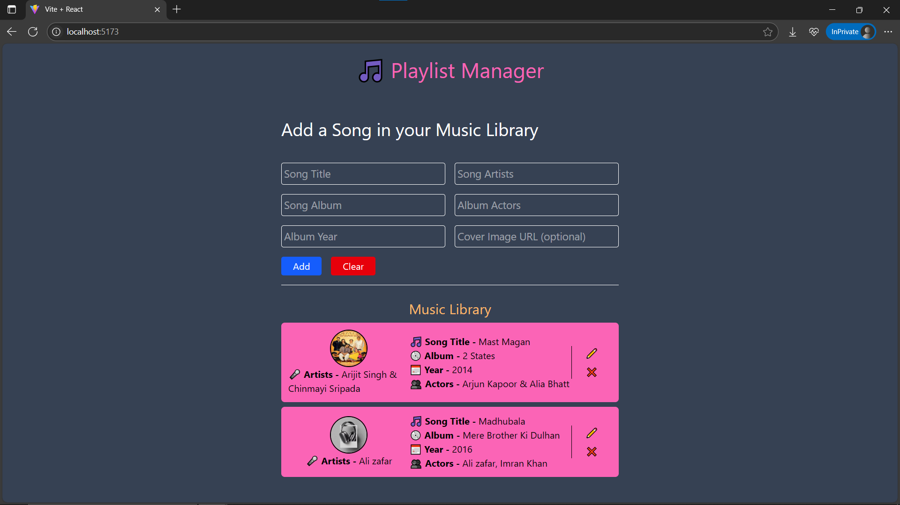
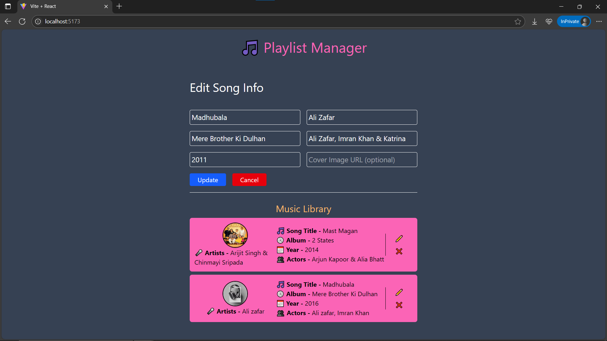

# Day30: Playlist Manager App – Final Project 🎧

## 🚀 What I Built

A full-featured **Playlist Manager** built in React to wrap up my **#30DaysOfReact** challenge. This app allows users to manage their personal music library by adding, editing, and removing songs with rich metadata like title, artists, album, year, and optional cover images.

---

## ✨ Features

- 🎶 Add new songs with details (title, artists, album, actors, year)
- ✏️ Edit any song inline using a unified form
- ❌ Delete a song from the list
- 🖼 Auto fallback to default cover image if none provided
- 📦 Data persists across sessions using `localStorage`
- 🧼 Validates empty fields before submission
- 🎨 Styled with Tailwind CSS
- ⚡ Built with Vite for blazing-fast development

---

## 🧠 What I Learned

- Reusing a single form component for both **create** and **edit**
- Managing **form validation** manually with React `useState` and `useRef`
- Lifting and passing state between components
- Controlled form inputs and validation UX
- Using `localStorage` with `useEffect` for persistence
- Better error UX with real-time input feedback
- Conditional rendering based on props (`editingSong`)

---

## 🛠️ Tech Stack

- React
- Tailwind CSS
- Vite
- localStorage API

---

## 📸 Screenshots





---

## 📦 How to Run Locally

```bash
git clone https://github.com/ravi18kumar2021/30DaysOfReact.git
cd 30DaysOfReact/Day30
npm install
npm run dev