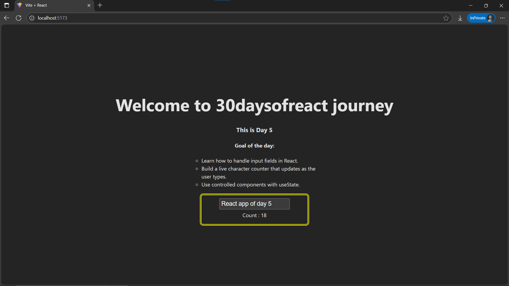

# Day5: Project - Character Counter App using React

## 🚀 What I Built
A simple **Character Counter** app in React that counts the number of characters in an input box as you type. This project focuses on **handling user input** using controlled components and React state.

---

## 🧠 What I Learned
- How to use the `useState` hook to track form input.
- The concept of **controlled components** in React.
- Handling `onChange` events on inputs and textareas.
- Real-time UI updates based on state changes.

---

## 🛠️ Tech Stack
- React + Vite
- JSX
- useState Hook
- Inline Styling

---

## 📸 Screenshot



---

## 🧪 How to Run Locally

```bash
git clone https://github.com/ravi18kumar2021/30DaysOfReact.git
cd 30DaysOfReact/Day5
npm install
npm run dev