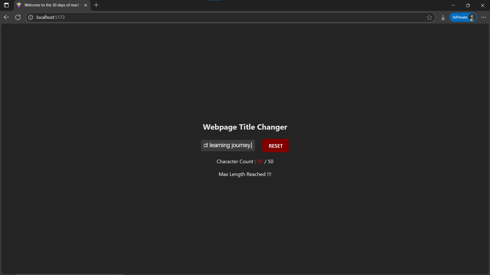

# Day8: Project - Document Title Changer with useEffect in React

## 🚀 What I Built

A simple **Document Title Changer** app using the `useEffect` hook. This project demonstrates how to interact with the browser’s document title dynamically based on user input.

- Real-time updates to the document title
- Input field bound to local state
- Minimal, focused use of React Hooks

---

## 🧠 What I Learned

- How to use the `useEffect` hook for side effects
- Dependency arrays in `useEffect` to control when effects run
- Real-time binding of input fields using `useState`
- Interacting with the DOM (document.title) inside React
- Component lifecycle awareness with effects

---

## 🛠️ Tech Stack

- React
- JSX
- Inline Styling
- useState Hook
- useEffect Hook

---

## 📸 Screenshot



---

## 🧪 How to Run Locally

```bash
git clone https://github.com/ravi18kumar2021/30DaysOfReact.git
cd 30DaysOfReact/Day8
npm install
npm run dev